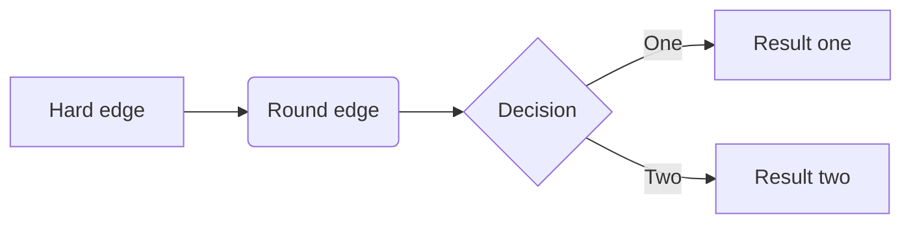

#有用得链接(GitHub)<br>
   [Basic writing and formatting syntax](https://help.github.com/en/github/writing-on-github/basic-writing-and-formatting-syntax)<br>
   [Mastering Markdown](https://guides.github.com/features/mastering-markdown/)<br>
   [Markdown Cheatsheet](https://github.com/adam-p/markdown-here/wiki/Markdown-Cheatsheet)<br>
   [emoji-cheat-sheet](https://github.com/ikatyang/emoji-cheat-sheet/blob/master/README.md) - 很好的图标，值得用用<br>
   [Note/GithubEmoji/emoji.md](https://github.com/jingyuexing/Note/blob/master/GithubEmoji/emoji.md) :heavy_check_mark:另一个很好的图标，值得参考<br>
   [Basic Syntax](https://www.markdownguide.org/basic-syntax/) - The Markdown elements outlined in John Gruber's design document.<br>

<head>
<link rel="stylesheet" type="text/css" href="github.css">
<link rel="stylesheet" type="text/css" href="colors.css">
</head>

* 备注：这个是用html标签做表格的例子。<br>
    <table>
        <tr>
            <th>设备</th>
            <th>设备文件名</th>
            <th>文件描述符</th>
            <th>类型</th>
        </tr>
        <tr>
            <th>键盘</th>
            <th>/dev/stdin</th>
            <th>0</th>
            <th>标准输入</th>
        </tr>
        <tr>
            <th>显示器</th>
            <th>/dev/stdout</th>
            <th>1</th>
            <th>标准输出</th>
        </tr>
        <tr>
            <th>显示器</th>
            <th>/dev/stderr</th>
            <th>2</th>
            <th>标准错误输出</th>
        </tr>
    </table>
# 颜色的使用<br>
   * 方法 1<br>
      +  `#f03c15`
      +  `#c5f015`
      +  `#1589F0`
   * approach 2<br>
      + 

      + 

      + 

```diff
+ this will be highlighted in green
- this will be highlighted in red
```

In case this may be helpful for someone who just needs to show colors rather than output, as a hackish workaround (and FYI), since Github supports Unicode numeric character references (and HTML entities), you could try colored Unicode symbols, though it depends on the font rendering them in color (as it happens to be appearing for me on Windows 10 and Mac 10.12.5, at least, though on the Mac at least, the up/down-pointing small red triangles don't show in red):

RED APPLE (&#x1F34E;): 🍎  
GREEN APPLE (&#x1F34F;): 🍏  
BLUE HEART (&#x1F499;): 💙  
GREEN HEART (&#x1F49A;): 💚  
YELLOW HEART (&#x1F49B;): 💛  
PURPLE HEART (&#x1F49C;): 💜  
GREEN BOOK (&#x1F4D7;): 📗  
BLUE BOOK (&#x1F4D8;): 📘  
ORANGE BOOK (&#x1F4D9;): 📙  
LARGE RED CIRCLE (&#x1F534;): 🔴  
LARGE BLUE CIRCLE (&#x1F535;): 🔵  
LARGE ORANGE DIAMOND (&#x1F536;): 🔶  
LARGE BLUE DIAMOND (&#x1F537;): 🔷  
SMALL ORANGE DIAMOND (&#x1F538;): 🔸  
SMALL BLUE DIAMOND (&#x1F539;): 🔹  
UP-POINTING RED TRIANGLE (&#x1F53A;): 🔺  
DOWN-POINTING RED TRIANGLE (&#x1F53B;): 🔻  
UP-POINTING SMALL RED TRIANGLE (&#x1F53C;): 🔼  
DOWN-POINTING SMALL RED TRIANGLE (&#x1F53D;): 🔽  

In his beard lived three <span style="color:red">cardinals</span>.

<h6 class="bg-navy">Hello World</h6>

<p class="bg-navy">This paragraph refers to two classes.</p>


<p style="color:DodgerBlue;">Lorem ipsum dolor sit amet, consectetuer adipiscing elit, sed diam nonummy nibh euismod tincidunt ut laoreet dolore magna aliquam erat volutpat.</p>

<p style="color:MediumSeaGreen;">Ut wisi enim ad minim veniam, quis nostrud exerci tation ullamcorper suscipit lobortis nisl ut aliquip ex ea commodo consequat.</p>


<table cellspacing="5">
<caption>Comparing weather and time zones</caption>
<tr>
<th>Location</th>
<th>Tucson, Arizona</th>
<th>Las Vegas, Nevada</th>
</tr>
<tr>
<th>Weather</th>
<td>Warm to Hot</td>
<td>Warm to Hot</td>
</tr>
<tr>
<th>Time Zone</th>
<td>No Daylight Savings</td>
<td  class="highlight">Mountain Standard Time</td>
</tr>
</table>




```sequence
Alice->Bob: Hello Bob, how are you?
Note right of Bob: Bob thinks
Bob-->Alice: I am good thanks!
```


```flow
st=>start: Start
op=>operation: Your Operation
cond=>condition: Yes or No?
e=>end

st->op->cond
cond(yes)->e
cond(no)->op
```
